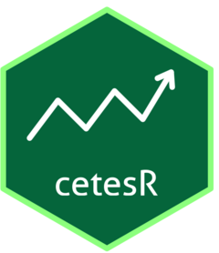
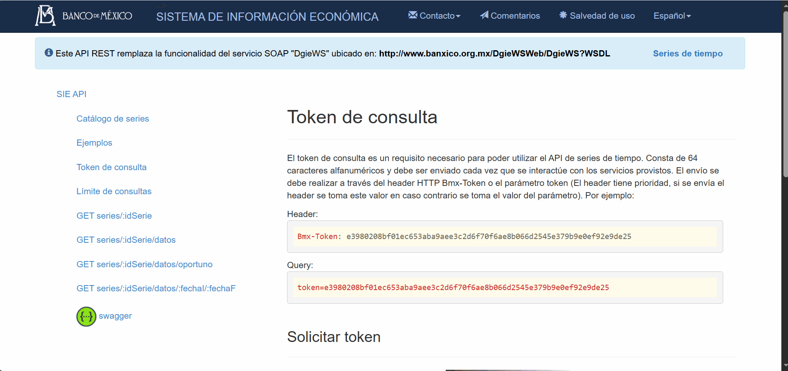

<!-- README.md is generated from README.Rmd. Please edit that file -->

```{r, include = FALSE}
knitr::opts_chunk$set(
  collapse = TRUE,
  comment = "#>",
  fig.path = "man/figures/",
  out.width = "100%"
)
```


# cetesR <a href="https://abemorc.github.io/cetesR/"></a>


<!-- badges: start -->
[](https://github.com/abemorc/cetesR/actions/workflows/R-CMD-check.yaml)
[](https://lifecycle.r-lib.org/articles/stages.html)
<!-- [](https://CRAN.R-project.org/package=cetesR) -->
[](https://opensource.org/licenses/MIT)
[](#)
[](#)
[](#)
<!-- badges: end -->

**cetesR** es un paquete de R diseñado para facilitar la extracción, procesamiento y análisis financiero de los valores gubernamentales de México (CETES, Bonos M y Udibonos). Obtiene información oficial directamente desde la API del Sistema de Información Económica (SIE) del **Banco de México (Banxico)** y la complementa con datos del mercado secundario.

---

## Instalación

Puedes instalar la versión de desarrollo de `cetesR` directamente desde GitHub utilizando el paquete `devtools`:

```r
if (!require("devtools")) {
  install.packages("devtools")
}

devtools::install_github("abemorc/cetesR")
```

---

## Configuración de la API de Banxico (Token)

Para utilizar las funciones de consulta, es necesario contar con un token de la API de Banxico, el cual es gratuito y se puede obtener sin necesidad de registro en su portal


### ¿Cómo obtener tu token?
1. Ingresa al portal oficial del [](https://www.banxico.org.mx/SieAPIRest/service/v1/token).
2. Ve a la parte de 'Solicitar token'
3. Introduce el captcha y presiona `Generar Token`

<!-- > *[ Opcional: Aquí puedes insertar tu GIF mostrando los clics en la página de Banxico ]* -->



### Configuración en R
Una vez que tengas tu token, configúralo de forma segura utilizando la función `set_banxico_token()`. Si utilizas el argumento `install = TRUE`, el token se guardará en tu archivo `.Renviron` para que no tengas que escribirlo nunca más:

```r
library(cetesR)

# Configuración permanente recomendada
set_banxico_token("TU_TOKEN_DE_BANXICO_AQUI", install = TRUE)
```
*(Nota: Si usaste `install = TRUE`, recuerda reiniciar tu sesión de R con `Ctrl + Shift + F10` la primera vez).*

---

## Casos de Uso

El diseño de las funciones de `cetesR`, en particular el orquestador `getBono`, está pensado para ahorrar horas de limpieza de datos, entregando información lista para análisis cuantitativo:

* **Integridad de Series de Tiempo:** Al extraer los datos primarios, la función cruza y alinea automáticamente los plazos, montos asignados y tasas de rendimiento basándose en la fecha exacta de la subasta. Esto elimina los riesgos de desalineación, entregando insumos limpios que pueden inyectarse directamente en modelos de pronóstico temporal o evaluación de volatilidades.
* **Cálculo Automático de Redención:** Por defecto, la API oficial no detalla cuándo vence un instrumento. El paquete calcula y anexa automáticamente la columna `Fecharedencion`, un dato algorítmico esencial para estructurar flujos de efectivo, valuar instrumentos derivados o proyectar tablas de contingencia sin requerir cálculos manuales posteriores.


### 1. Consultar información integral de un instrumento (`getBono`)
La función principal del paquete consolida los datos históricos de plazos, montos asignados, tasas de rendimiento y la información del mercado secundario en una sola lista estructurada:


```{r}
library(cetesR)

# Obtener toda la información histórica y reciente de CETES a 28 días
cetes_28 <- getBono(
  bono = "cetes28", 
  fechaInicial = "2023-01-01", 
  fechaFinal = Sys.Date()
)

# Revisar los metadatos oficiales de la serie
head(cetes_28$Metadatos)

# Consultar las primeras filas del data.frame consolidado de tasas y montos
head(cetes_28$cetes28_Datos)
```

### 2. Visualización rápida del rendimiento histórico
Gracias a que la estructura devuelta se integra de forma nativa con el *tidyverse*, puedes generar gráficos analíticos en cuestión de segundos utilizando `ggplot2`:

```{r}
library(ggplot2)

# Gráfico de la evolución de la tasa de rendimiento de CETES 28 días
ggplot(cetes_28$cetes28_Datos, aes(x = Fecha_emision, y = Tasa_rendimiento)) +
  geom_line(color = "#1b396a", linewidth = 0.8) +
  labs(
    title = "Evolución Histórica - CETES 28 días",
    subtitle = "Fuente: Banco de México (cetesR)",
    x = "Fecha de Emisión",
    y = "Tasa de Rendimiento (%)"
  ) +
  theme_minimal()
```

### 3. Modelado Cuantitativo: Distribución y Posicionamiento Histórico

En finanzas cuantitativas, evaluar si el entorno actual de tasas es anómalo requiere analizar la distribución histórica completa. Gracias a la estructura de panel que devuelve `cetesR`, podemos generar un gráfico de densidad probabilística en un par de líneas para observar en qué percentil de la historia nos encontramos hoy.

```{r}
library(cetesR)
library(ggplot2)
library(dplyr)

# 1. Extraemos la tasa de rendimiento más reciente del objeto que ya descargamos
tasa_actual <- cetes_28$cetes28_Datos |> 
  filter(Fecha_emision == max(Fecha_emision, na.rm = TRUE)) |> 
  pull(Tasa_rendimiento) |> 
  first()

# 2. Generamos el gráfico de densidad histórica
ggplot(cetes_28$cetes28_Datos, aes(x = Tasa_rendimiento)) +
  geom_density(fill = "#1b396a", alpha = 0.5, color = "#092243", linewidth = 0.8) +
  geom_vline(xintercept = tasa_actual, color = "#d9534f", linetype = "dashed", linewidth = 1.2) +
  annotate(
    "text", x = tasa_actual + 0.3, y = 0.05, 
    label = paste("Nivel Actual:", tasa_actual, "%"), 
    color = "#d9534f", angle = 90, fontface = "bold"
  ) +
  labs(
    title = "Distribución Histórica de la Tasa CETES 28 de 2023 a 2026",
    subtitle = "Análisis de densidad probabilística y entorno actual",
    x = "Tasa de Rendimiento (%)",
    y = "Densidad"
  ) +
  theme_minimal()
```


### 4. Consultas directas a la API (Series individuales)
Si solo requieres consultar una serie específica mediante su identificador oficial de Banxico:

```{r}
# Obtener el último dato oportuno publicado para la tasa de CETES 28 (SF43718)
ultimo_dato <- consultaApiDatoUltimo(codigo = "SF43718")
print(ultimo_dato)
```

---

## Contribuciones y Soporte
Las contribuciones, reportes de errores y sugerencias son completamente bienvenidos. Por favor, abre un *Issue* en el repositorio de GitHub para discutir cualquier mejora propuesta.

